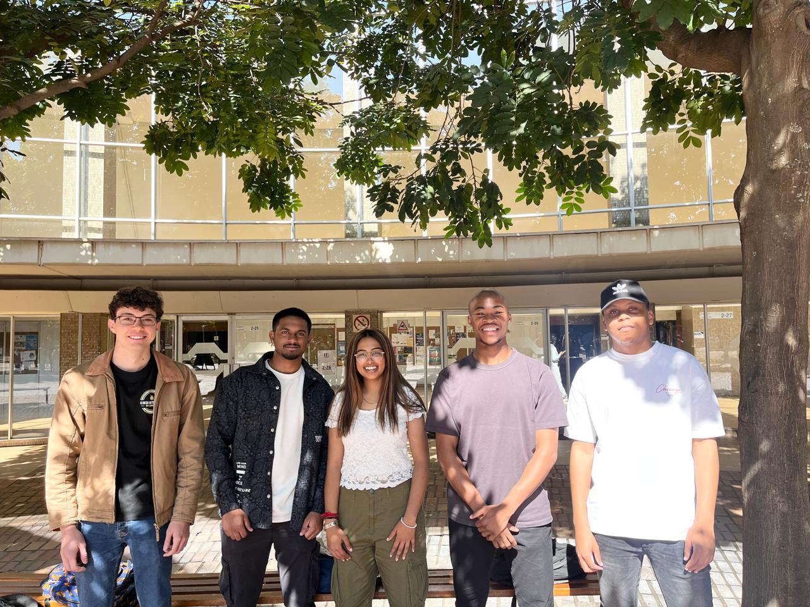

# ABC Travel Planner
## Project Description
We are pleased to present our proposal for the ABC Travel Planner, a next-generation travel
planning and booking website that aims to revolutionise the way travellers plan and book their
trips. Combining the strengths of TripAdvisor and Booking.com with new innovative features,
the ABC Travel Planner will offer users a seamless and personalised travel experience.

<table>
  <tr>
    <th>Project Board</th>
    <td><li><a href="https://github.com/orgs/COS301-SE-2024/projects/103">Project Board</a></li></td>
  </tr>
  <tr>
    <th>Videos & Documentation</th>
    <td>
       <li><a href="https://drive.google.com/drive/folders/1lyyva4NtzyIOwxwUOKRMtfsFis6fee8h?usp=sharing">Google drive link</a></li>
       <li><a href="https://veed.io/view/a8eb279a-7151-4b56-8462-68033f450bc9">Marketing Video</a></li>
       <li><a href="https://drive.google.com/file/d/1Yv7qGqQZTg5L9Ttqrj5DNDWKZkZOT67i/view?usp=drive_link">Tutorial Video</a></li>
    </td>
  </tr>
</table>

## Deployed solution:
Click <a href="https://abctravelplanner-8a6f6247b848.herokuapp.com" alt="Deployed Heroku App">here</a> to access the deployed app🚀

## Meet the Team

## Team Members and Roles

| Name | Roles | Description |
|:------:|:------:|---------------|
|    **Mishka Dukhanti** (u22617541)   |Project Manager, Business Analyst and UI Designer & Engineer| I love a challenge and coding always brings one, Love working with my team. Having a work-hard and play-hard balance is important to me.|
|    **Aidan Govender** (u22520458)   |Testing & Integration Engineer, Business Analyst, Architect| Hi, my name is Aidan Govender. I am always enthusiastic about expanding my knowledge in the field of information technology. I am well-versed in multiple programming languages and data structures. Technology has always fascinated me, and it motivates me to be an agent of change wherever I find myself in the technological space. |
|    **Victor Igbojinna** (u22492616)   |Integration & DevOps Engineer, UI Engineer | I am a final year Computer Science student aspiring to be a Software engineer particularly focusing on backend development |
|    **Kabelo Motloung** (u22566954)   |Services & Integration Engineer | 👋 Hello! I'm Kabelo, a final-year Computer Science student with a passion for software engineering. I love creating innovative solutions to real-world problems and constantly challenging myself to learn and grow in this ever-evolving field. |
|    **Calvyn Van Wyngaardt** (u22656342)  |Integration Engineer, Data Engineer, Business Analyst|Being passionate about computers since a young age I've always been, and still am, keen to learn new things. I am by heart a very curious person, who likes to delve deeper into the inner workings of processes and systems. I enjoy tinkering, trying new things and spending time with people. |

# Software Technologies:

  

### Software Technology Used:

<table>
  <tr>
    <td style="text-align:center; vertical-align:middle;"></td>
    <td style="text-align:left; vertical-align:middle;">NestJS was used to build a backend service</td>
  </tr>
  <tr>
    <td style="text-align:center; vertical-align:middle;"></td>
    <td style="text-align:left; vertical-align:middle;">Figma was used to prototype designs for our frontend</td>
  </tr>
  <tr>
    <td style="text-align:center; vertical-align:middle;"></td>
    <td style="text-align:left; vertical-align:middle;">Git was used for version control</td>
  </tr>
  <tr>
    <td style="text-align:center; vertical-align:middle;"></td>
    <td style="text-align:left; vertical-align:middle;">Github collaboration with the team</td>
  </tr>
  <tr>
    <td style="text-align:center; vertical-align:middle;"></td>
    <td style="text-align:left; vertical-align:middle;">Github actions facilitated automatic testing and other necessary functions</td>
  </tr>
  <tr>
    <td style="text-align:center; vertical-align:middle;"></td>
    <td style="text-align:left; vertical-align:middle;">Jest was used to write unit tests for our backend services</td>
  </tr>
  <tr>
    <td style="text-align:center; vertical-align:middle;"></td>
    <td style="text-align:left; vertical-align:middle;">All README's are implemented in Markdown</td>
  </tr>
  <tr>
    <td style="text-align:center; vertical-align:middle;"></td>
    <td style="text-align:left; vertical-align:middle;">Flask was used as the web application for the chatbot model</td>
  </tr>
  <tr>
    <td style="text-align:center; vertical-align:middle;"></td>
    <td style="text-align:left; vertical-align:middle;">Google Cloud was used to integrate the Google Maps api and to set up email sending capabilities</td>
  </tr>
  <tr>
    <td style="text-align:center; vertical-align:middle;"></td>
    <td style="text-align:left; vertical-align:middle;">A React framework that simplifies server-side rendering and routing</td>
  </tr>
  <tr>
    <td style="text-align:center; vertical-align:middle;"></td>
    <td style="text-align:left; vertical-align:middle;">Firebase is the core database and authentication service, used to manage all stored application data </td>
  </tr>
  <tr>
    <td style="text-align:center; vertical-align:middle;"></td>
    <td style="text-align:left; vertical-align:middle;">Tailwind is a CSS framework used to implement styling</td>
  </tr>
  <tr>
    <td style="text-align:center; vertical-align:middle;"></td>
    <td style="text-align:left; vertical-align:middle;">Heroku was used to deploy our chatbot, frontend and backend solutions to a platform</td>
  </tr>
  <tr>
    <td style="text-align:center; vertical-align:middle;"></td>
    <td style="text-align:left; vertical-align:middle;">A docker container was set up and used to create a stable environment to build and deploy the chatbot</td>
  </tr>
  <tr>
    <td style="text-align:center; vertical-align:middle;"></td>
    <td style="text-align:left; vertical-align:middle;">Python was used to create scripts for sending emails as well as building the chatbot</td>
  </tr>
</table>
